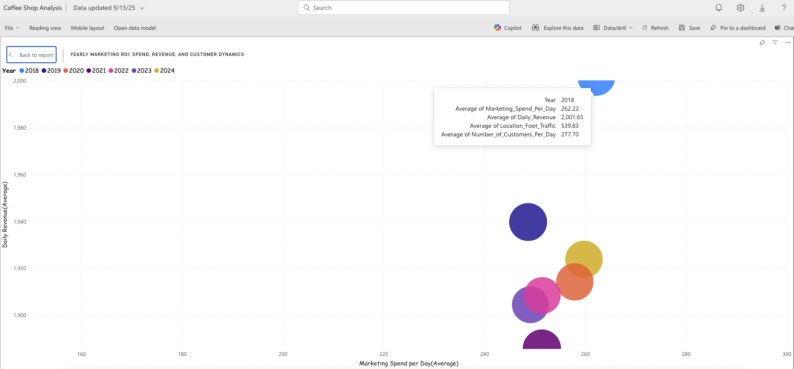
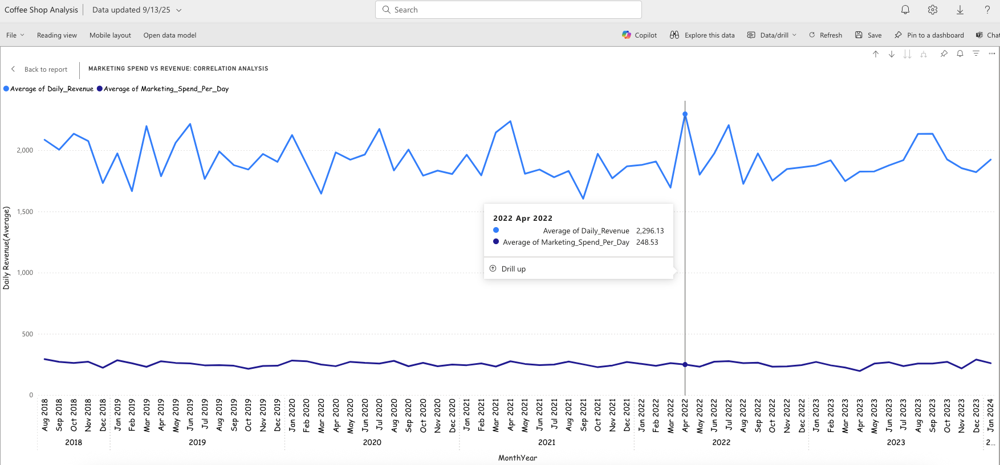
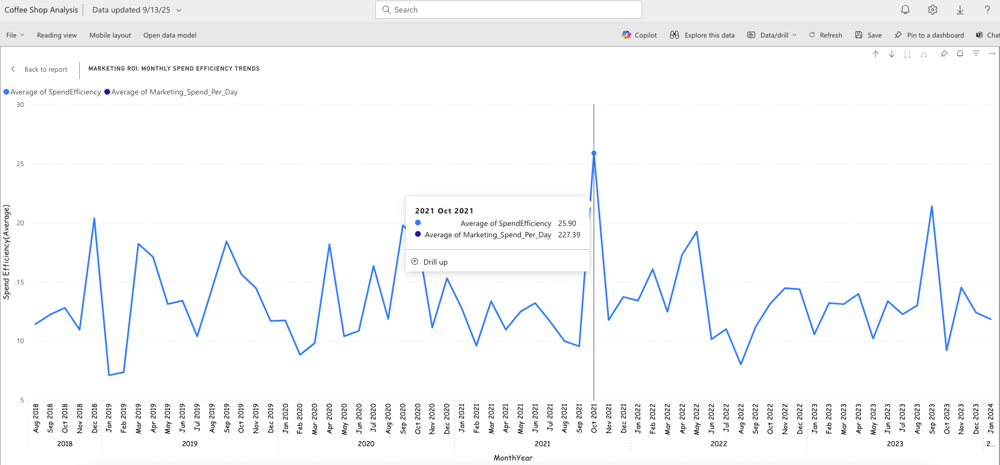

# ☕ Coffee Shop Marketing ROI Analyis

A multi-layered business intelligence dashboard analysing the relationship between marketing spend and daily revenue across multiple years. Built in Excel and Power BI using simulated transactional data from a coffee shop POS system, this project explores spend efficiency, customer dynamics, and strategic budgeting recommendations.

This dashboard simulates stakeholder reporting and decision support across three analytical stages:

1. **Yearly Marketing ROI** – Visualise annual spend, revenue, and customer volume  
2. **Correlation Analysis** – Track monthly trends in marketing spend vs revenue  
3. **Spend Efficiency Trends** – Identify optimal budget thresholds for maximum ROI

---

## Stage One: Yearly Marketing ROI  
### 📊 Visualisation  
Bubble chart showing annual averages of marketing spend vs revenue, with bubble size representing average customer volume. Includes slicer for Year Type (Full vs Partial).

### 💡 Insights  
- 2018 is a partial-year outlier with higher spend and revenue  
- Across complete years, optimal spend efficiency and peak revenue occur below the £250 daily spend threshold

---

## Stage Two: Marketing Spend vs Revenue – Correlation Analysis  
### 📊 Visualisation  
Line chart tracking monthly trends from **August 2018 to January 2024**.  
- Tooltip highlights April 2022 peak values  
- Data markers hidden to maintain visual clarity

### 💡 Insights  
- Revenue fluctuates significantly while spend remains relatively stable  
- No consistent correlation between higher spend and increased revenue

---

## Stage Three: Marketing ROI – Monthly Spend Efficiency Trends  
### 📊 Visualisation  
Line chart comparing monthly spend efficiency against marketing spend from **August 2018 to January 2024**.   
- Tooltip highlights October 2021 peak efficiency

### 💡 Insights  
- Efficiency peaks around £227–£248  
- Supports recommendation to keep spend below £250 for optimal ROI

---

## 🧠 Strategic Summary

> Increased marketing spend does not consistently correlate with higher daily revenue, except in 2018; a partial year and statistical outlier.  
> Across complete years, optimal spend efficiency and strong revenue performance consistently occur below the £250 daily spend threshold.

---

## 💡 Recommendations

- Revise the daily marketing budget to remain below £250  
- Target spend levels around £227–£248 for optimal efficiency  
- Monitor monthly trends to refine campaign timing and channel allocation  
- Leverage customer data to personalise marketing efforts and improve ROI

---

## 📂 Data Source

This dashboard uses the [Coffee Shop Daily Revenue Prediction dataset](https://www.kaggle.com/datasets/himelsarder/coffee-shop-daily-revenue-prediction-) from Kaggle.

---

## 📝 Notes

> 📅 *Date Generation*: The original dataset did not include timestamp fields. Month-Year values were generated manually to simulate a realistic time series for trend analysis and visual storytelling.

> 🧹 *Data Preparation*: The dataset was downloaded as a CSV file and imported into Excel for cleaning and formatting. Visualisations were built in Power BI.

---

## 🛠️ Tools Used

- Excel (Data Cleaning & Structuring)  
- Power BI (Dashboard Design & Visualization)  
- GitHub (Portfolio Hosting)

---

## 👤 Author

**Doreen Olu Abara** – Junior Data Analyst with a passion for visual storytelling, stakeholder reporting, and data-driven service improvement.
